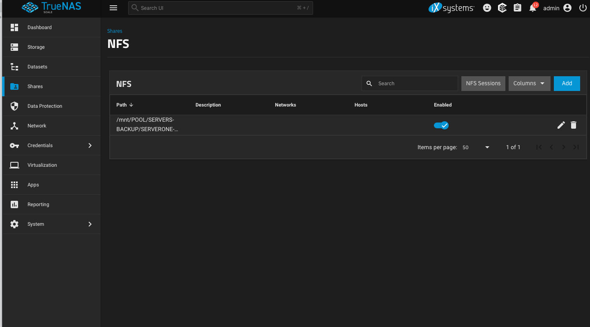
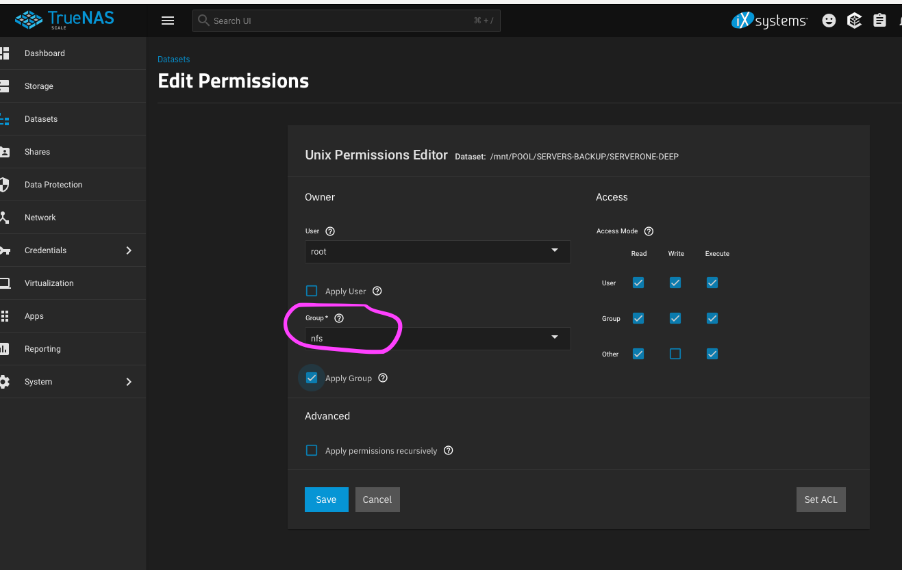
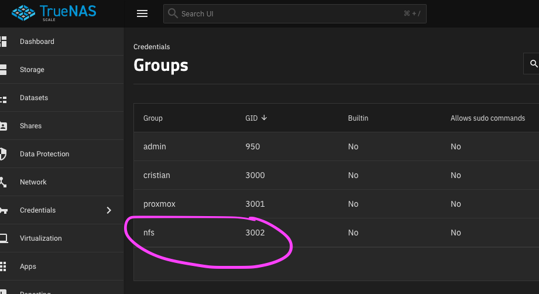

# LINUX backups on truenas via Nfs

### First lets configure the NFS service in Truenas


### Create the mount point
```yaml
sudo mkdir /mnt/backups
```

### Create the gruenas group
```
sudo groupadd nfs
```

### Add current user to nfs Group
```yaml
sudo usermod -aG nfs cristianku
```

### Change the Group Ownership of the Mount Point
```yaml
sudo chown -R root:nfs /mnt/backups
```

### to allow new files and directories created under this mount point to inherit the truenas group automatically,
```yaml
sudo chmod -R g+s /mnt/backups
```
### set the corrent permission on the truenas datase adding the Group nfs


### check the GID of the nfs group


### Change the group id in your LInux server:
```yaml
sudo groupmod -g 3002 nfs

```
### Mount 
```yaml
sudo mount -t nfs 192.168.200.35:/mnt/POOL/SERVERS-BACKUP/SERVERONE-DEEP /mnt/backups
```

### Edit the /etc/fstab File
```yaml
sudo vi /etc/fstab
```

### Add the following line to mount the NFS share at boot:
```yaml
192.168.200.35:/mnt/POOL/SERVERS-BACKUP/SERVERONE-DEEP /mnt/backups nfs defaults,rw 0 0

```

### reload fstab
```yaml
sudo mount -a
```

### create the script to backup the home folder
```yaml
mkdir /mnt/backups/cristianku
```

edit the script
```yaml
vi ~/rsync_backup.sh
```

```yaml
#!/bin/bash
rsync -avh --delete --progress /home/cristianku/ /mnt/backups/cristianku/ >> ~/rsync_backup.log 2>&1
```

edit crontab
```yaml
crontab -e
```
Add the following line to schedule the rsync job:
0 * * * *: Runs the command every hour at the start of the hour.

```yaml
0 * * * * /bin/bash ~/rsync_backup.sh
```