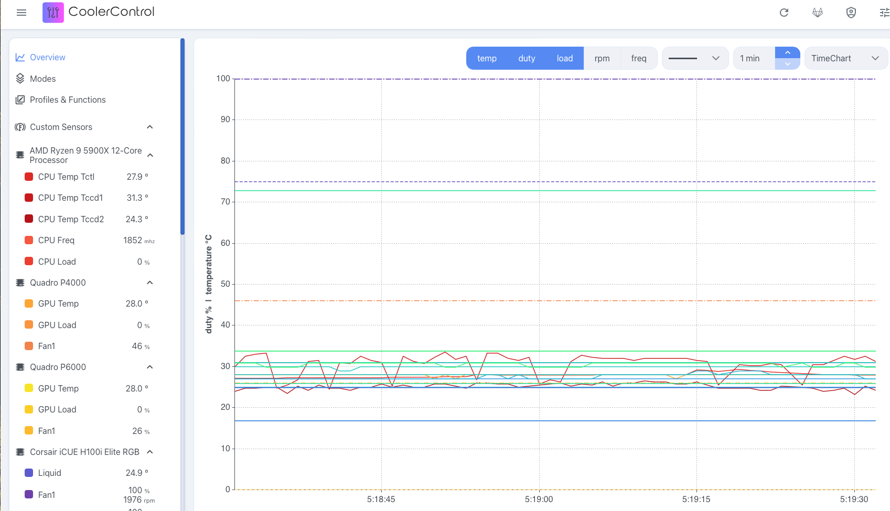

# NVIDIA COOLER CONTROL

#### COnfiguring COoler Control

Fedora
```bash
# make sure you have the necessary plugin:
sudo dnf install dnf-plugins-core
sudo dnf copr enable codifryed/CoolerControl
sudo dnf install coolercontrol
sudo systemctl enable --now coolercontrold
sudo systemctl start coolercontrold
```


#### Enable the Web UI access from an other computer:
we need to forward the port via SSH

```yaml
ssh -R 11987:localhost:11987 192.168.88.36
```
where 192.168.88.36 is the desktop computer ip address 

you can also specify the remote username:
```yaml
ssh -R 11987:localhost:11987 cristianku@192.168.88.36
```


Now you can access from your desktop computer the address

```yaml
http://localhost:11987

```


